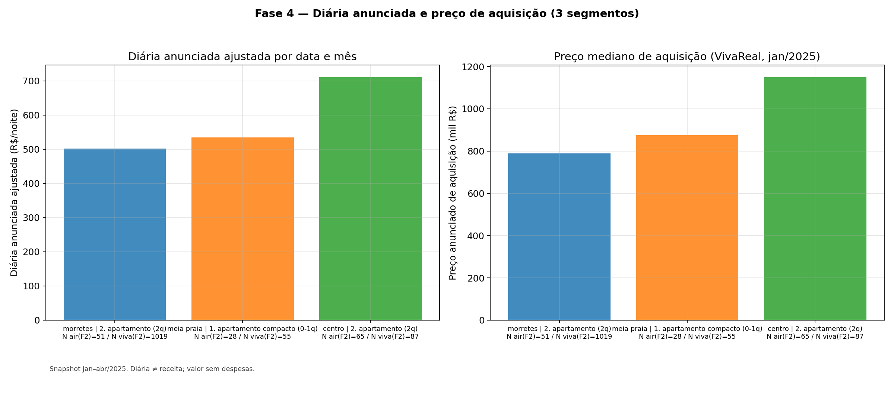
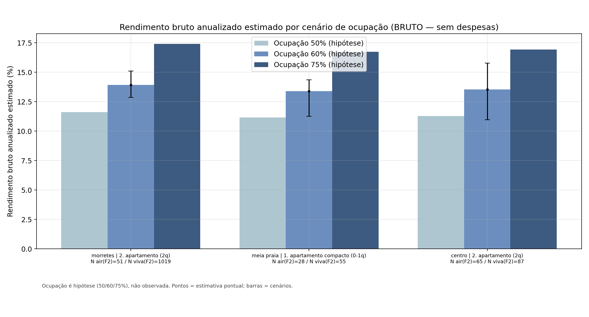
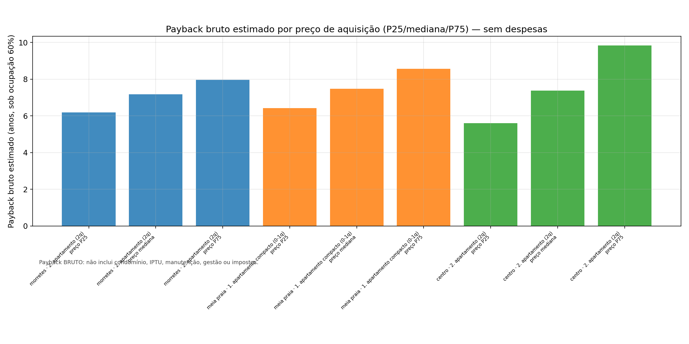
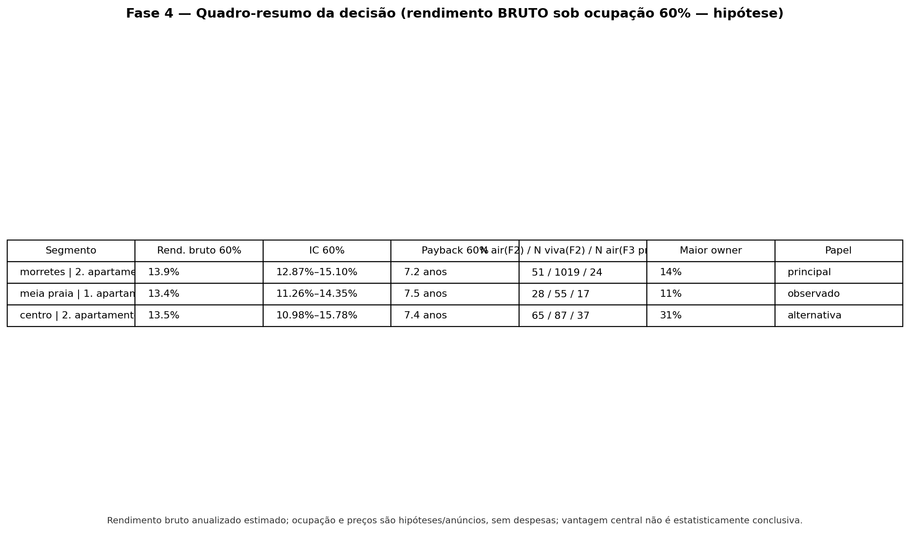

[LINK PENDENTE — será inserido separadamente antes da entrega]

# Jovens Talentos 2026 — Recomendação de investimento imobiliário em Itapema

- **Autora:** Pâmmela Vicenti Ribeiro
- **Repositório:** https://github.com/pammelavicenti/jt2026-pammela-ribeiro

## 1. Resumo executivo

Este repositório consolida a análise do mercado imobiliário de Itapema (SC), baseada no snapshot de janeiro de 2025 (Airbnb + VivaReal), com o objetivo de apoiar a decisão de investimento em short stay. A recomendação principal é **Morretes — apartamento de 2 quartos**, com **rendimento bruto anualizado estimado de 13,9%** no cenário hipotético de ocupação de 60%, **IC bootstrap de 95%: 12,9% a 15,1%** e **payback bruto estimado de 7,2 anos**. A alternativa é **Centro — apartamento de 2 quartos**. A confiança é **moderada**: a vantagem do segmento principal sobre os demais é pequena e **não foi demonstrada como estatisticamente conclusiva** (os intervalos de bootstrap se sobrepõem). A decisão é **condicionada à validação de ocupação, despesas operacionais e preço efetivamente negociado**.

> Terminologia: usamos **diária anunciada ajustada**, **receita bruta anualizada estimada**, **rendimento bruto anualizado estimado** e **payback bruto estimado**. Não há receita realizada, lucro, retorno líquido, ocupação observada ou garantia.

## 2. Pergunta de negócio

Qual o melhor perfil e localização para a Seazone investir em imóveis de short stay em Itapema, considerando a diária anunciada, o preço de aquisição, o rendimento bruto estimado, a incerteza e a estabilidade nas sensibilidades? O desafio também pede uma posição sobre a tese interna de que apartamentos compactos (0–1 quarto) no Centro seriam a aposta mais eficiente.

## 3. Recomendação principal

**Morretes — apartamento de 2 quartos.** Foi o segmento mais defensável pelos critérios adotados: rendimento bruto anualizado estimado de 13,9% no cenário central (ocupação 60%), IC bootstrap de 95% entre 12,9% e 15,1%, payback bruto estimado de 7,2 anos, amostra VivaReal ampla (1.019) e liderança em quatro dos cinco cenários de sensibilidade. Risco principal: a vantagem é pequena e não demonstrada como estatisticamente conclusiva.

## 4. Alternativa

**Centro — apartamento de 2 quartos.** Segundo mais defensável. Seria preferível nos cenários conjuntos em que o preço de aquisição assumido é o P25 de cada segmento (rendimento do Centro de 17,8% contra 16,2% de Morretes) e no cenário cruzado Centro@P25 versus Morretes@mediana (detalhes em `outputs/analysis/final/condition_change_scenarios.csv`).

## 5. Principais números

Fonte: `outputs/analysis/final/decision_matrix.csv` (importada automaticamente).

| Segmento | N Airbnb (F2) | N Airbnb principal (F3) | N VivaReal elegível | Rend. bruto 60% | IC bootstrap 95% | Payback bruto | Posição na decisão |
|---|---|---|---|---|---|---|---|
| morretes — 2. apartamento (2q) | 51 | 24 | 1019 | 13.9% | 12.87%–15.10% | 7.2 anos | Recomendação principal |
| centro — 2. apartamento (2q) | 65 | 37 | 87 | 13.5% | 10.98%–15.78% | 7.4 anos | Alternativa |
| meia praia — 1. apartamento compacto (0-1q) | 28 | 17 | 55 | 13.4% | 11.26%–14.35% | 7.5 anos | Observado (N<20 na F3: descritivo) |

Vídeo de apresentação pendente na primeira linha do README. Outros cenários (50%, 75%, preço P25/P75, outliers) em `outputs/analysis/final`.

## 6. Como interpretar as métricas

- **Diária anunciada ajustada por data e mês:** média ponderada igual dos quatro meses (jan–abr/2025), calculada apenas quando os 4 meses estão presentes. Não é receita realizada.
- **Receita bruta anualizada estimada:** diária ajustada × 365 × cenário de ocupação (50/60/75% — hipóteses, não ocupação observada).
- **Rendimento bruto anualizado estimado:** receita bruta ÷ preço anunciado de aquisição (mediana VivaReal). É bruto: exclui condomínio, IPTU, manutenção, gestão e impostos.
- **Payback bruto estimado:** inverso do rendimento bruto (anos).
- **IC bootstrap de 95%:** reamostragem por anúncio/owner, seed 42, 1.000 réplicas. Não é intervalo causal.

## 7. Bases utilizadas

Snapshot estático de janeiro/2025 (Itapema/SC):
- `data/Details_Itapema.csv` — anúncios Airbnb (4.441);
- `data/Hosts_ids_Itapema.csv` — anfitriões;
- `data/Mesh_Ids_Data_Itapema.csv` — localização/bairro;
- `data/Price_AV_Itapema.csv` — preços anunciados por anúncio e data (3 ondas jan/2025);
- `data/VivaReal_Itapema.csv` — anúncios de venda (8.293 após dedupe).

## 8. Metodologia resumida

1. **Preparação** (`scripts/build_base.py`): dedupe e limpeza reproduzíveis; 33 verificações;
2. **Fase 1** (`analyze_profile_location.py`): diária anunciada ajustada por perfil e bairro; teste da tese dos compactos no Centro (não sustentada);
3. **Fase 2** (`analyze_investment_efficiency.py`): preço de aquisição (VivaReal) e rendimento/payback brutos por segmento em cenários de ocupação;
4. **Fase 3** (`analyze_listing_characteristics.py`): características associadas à diária (associação ≠ causalidade);
5. **Fase 4** (`synthesize_recommendation.py`): matriz de decisão e recomendação integrada.

## 9. Estrutura do repositório

```
data/                      dados brutos (snapshot jan/2025)
scripts/                   pipeline (build_base e Fases 1–4)
docs/                      metodologia de dados e rastreabilidade
outputs/processed/         bases derivadas (reproduzíveis; não versionadas)
outputs/quality/           auditorias da preparação
outputs/analysis/          results fases 1–4 + figuras
ai-log/                    conversas com a IA (exportadas em texto)
relatorio.md               relatório técnico consolidado
README.md                  este documento
requirements.txt           dependências
```

## 10. Como reproduzir

Windows PowerShell:

```powershell
python -m venv .venv
.venv\Scripts\Activate.ps1
python -m pip install --upgrade pip
pip install -r requirements.txt

python scripts\build_base.py
python scripts\analyze_profile_location.py
python scripts\analyze_investment_efficiency.py
python scripts\analyze_listing_characteristics.py
python scripts\synthesize_recommendation.py
```
Python 3.13.5 · pandas 3.0.5 · numpy 2.4.4 (ver `requirements.txt`). Cada script aborta sem gravar se alguma verificação estrutural falhar; `outputs/processed/*.csv` são regenerados automaticamente (não versionados).

## 11. Resultados por fase

- **Fase 1 — Perfil e localização:** maiores diárias ajustadas em aptos 3q+ (R$ 793) e Meia Praia (R$ 674); a tese dos compactos no Centro **não foi sustentada** (vs aptos 2q+ no Centro, IC da diferença todo negativo).

- **Fase 2 — Preço e eficiência econômica:** ranking central a 60% liderado por Morretes·2q (13,9%), Centro·2q (13,5%) e Meia Praia·compacto (13,4%).

- **Fase 3 — Características:** nº de quartos com associação positiva à diária (por 1 desvio-padrão), mas sensível à presença de outliers (42,6% → 17,0%); nenhuma comodidade isolada atendeu aos critérios de estabilidade; sem evidência causal.

- **Fase 4 — Síntese:** matriz de decisão e esta recomendação (veja `outputs/analysis/final/final_recommendation.md`).

## 12. Limitações

- Diária anunciada ≠ receita; sem reservas/ocupação observadas (ocupação é cenário).
- Rendimento e payback **brutos**: sem condomínio, IPTU, manutenção, gestão, impostos ou financiamento.
- Preço de aquisição é o **anunciado** (VivaReal), não o negociado.
- Comparação agregada bairro×perfil sem chave comum entre Airbnb e VivaReal.
- Sazonalidade observável apenas jan–abr/2025; anualização é extrapolação.
- Concentração por proprietário representa risco de representatividade.

## 13. Uso de inteligência artificial

Todo o pipeline (preparação, análises 1–4 e esta documentação) foi construído de forma **iterativa com IA (OpenCode)**, com revisões metodológicas explícitas a cada fase: deduplicação, elegibilidade de preços, bootstrap por clusters de owner preservando multiplicidade, validação cruzada por owner, gate de saída (gravar apenas após todas as verificações) e revisão crítica de resultados. As conversas completas estão exportadas em texto em `ai-log/`.

## 14. Link para o relatório técnico

- Relatório técnico consolidado: [relatorio.md](relatorio.md)
- Rastreabilidade dos resultados: [docs/rastreabilidade.md](docs/rastreabilidade.md)
- Metodologia de dados: [docs/metodologia_dados.md](docs/metodologia_dados.md)
- Recomendação final: [outputs/analysis/final/final_recommendation.md](outputs/analysis/final/final_recommendation.md)
- Matriz de decisão: [outputs/analysis/final/decision_matrix.csv](outputs/analysis/final/decision_matrix.csv)
- Registro completo do uso de IA: [ai-log/](ai-log/)
- Figuras: [outputs/analysis/final/figures/](outputs/analysis/final/figures/)

### Figuras (Fase 4)






## 15. Pendências para a entrega

- [ ] Inserir o **link do vídeo** (seção 1), compartilhado com 'qualquer pessoa com o link'.
- [ ] Revisão final em aba anônima do repositório público.
- [ ] Enviar o formulário de entrega com os links do repositório e do vídeo.
